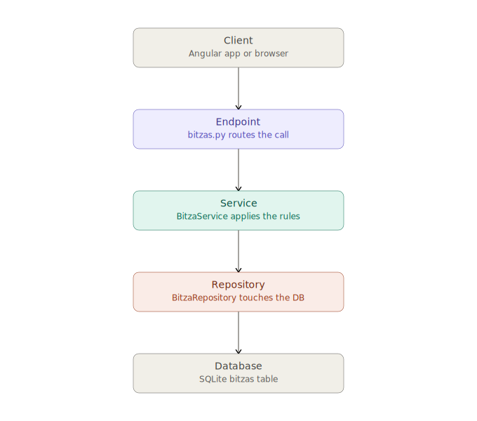

Every layer in Bitza exists for one reason: **each one should only have to think about one kind of problem.** The diagram shows the shape; here's what actually happens at each stop, using a real example — a POST request to create a new multimeter.



## The request: `POST /api/v1/bitzas/`

```json
{"name": "Fluke 117", "kind": "mobile", "responsible_team_id": "abc-123"}
```

### 1. Routing — `main.py` and `router.py`

Nothing clever happens here; it's just addressing. `main.py` mounts one big router under `/api/v1`:

```python
app.include_router(api_router, prefix=settings.API_V1_PREFIX)
```

`api_router` is itself just a list of smaller routers glued together in `app/api/v1/router.py`:

```python
api_router.include_router(bitzas.router)
```

FastAPI matches the path and method (`POST /api/v1/bitzas/`) to exactly one Python function. That's it — no logic, just a lookup table.

### 2. Dependencies run *before* your function does

The endpoint declares `current_user: User = Depends(get_current_user)`. FastAPI sees that and, before calling the endpoint, calls `get_current_user` in `dependencies.py` — which itself depends on `get_auth_service` and `get_user_repository`, which depend on `get_db`. FastAPI resolves this whole chain and — important detail — **reuses the same `Session` for every dependency in that chain**, so the auth check and the actual database work later share one transaction.

```python
def get_current_user(credentials=Depends(_bearer), auth_service=Depends(get_auth_service), ...):
    user_id = auth_service.get_current_user_id_from_access_token(credentials.credentials)
    user = user_repo.get_by_id(user_id)
    if not user.is_active:
        raise UserSuspendedError()
    return user
```

If the token's bad or the account's suspended, the request dies right here — your endpoint function never runs at all.

### 3. Schemas validate the body — also before your function runs

This is the one beginners most often miss: **Pydantic validation happens automatically**, driven by the type hint on the endpoint parameter (`body: BitzaCreate`). You never call `.validate()` yourself. In this project that validation is genuinely doing work, not just checking types — `BitzaCreate` has a `model_validator` that enforces "if `kind='stock'`, you must supply `stock_mode`; if `stock_mode='exact'`, you must supply `quantity`." Send a `kind='mobile'` bitza with a `quantity` field and it's rejected with a 422 before a single line of your endpoint or service code executes.

### 4. The endpoint — thin, on purpose

```python
@bitzas_router.post("/", response_model=BitzaRead, status_code=201)
def create_bitza(body: BitzaCreate, current_user=Depends(get_current_user), svc=Depends(get_bitza_service)):
    return svc.create_bitza(data=body, actor=current_user)
```

That's the entire function. No `if`, no database access, nothing. Its only jobs are: declare what URL/method it answers to, declare what shape the input and output are, and hand off to the service. If you ever find yourself writing business logic in a file under `endpoints/`, that's the tell you're in the wrong layer.

### 5. The service — where the actual thinking happens

`BitzaService.create_bitza` is where every rule about *what's allowed* lives:

```python
def create_bitza(self, data: BitzaCreate, actor: User) -> BitzaRead:
    if data.parent_id and not self._bitzas.get(data.parent_id):
        raise _not_found("Parent bitza not found")
    if not self._teams.get(data.responsible_team_id):
        raise _not_found("Responsible team not found")
    purchased_by = data.purchased_by_user_id or actor.id
    bitza = Bitza(id=str(uuid.uuid4()), name=data.name, kind=data.kind, ...)
    created = self._bitzas.create(bitza)
    self._write_audit("bitza", created.id, "CREATE", actor.id, f"Created '{created.name}'")
    self._db.commit()
    return self._enrich_bitza(created)
```

Notice it never writes a `SELECT` or `INSERT` itself — it asks `self._bitzas` (a `BitzaRepository`) and `self._teams` (a `TeamRepository`) to do that. The service's job is *deciding*: does the parent exist, does the team exist, who counts as the purchaser if none was given. It's also the only layer allowed to call `self._db.commit()` — repositories never do, which matters when a service needs several repository calls to succeed or fail together as one transaction.

### 6. The repository — deliberately dumb

```python
class BitzaRepository:
    def create(self, bitza: Bitza) -> Bitza:
        self._db.add(bitza)
        self._db.flush()
        self._db.refresh(bitza)
        return bitza
```

No `if`, no decision-making. A repository's whole vocabulary is "get this," "list these," "add this," "delete this." This is what makes repositories easy to test in isolation and easy to swap — the service doesn't know or care that it's SQLite under the hood.

### 7. The model — what actually gets written

`Bitza` (in `app/models/bitza.py`) is a SQLAlchemy class — it's the mapping between Python attributes and actual table columns:

```python
class Bitza(Base):
    __tablename__ = "bitzas"
    id: Mapped[str] = mapped_column(String(36), primary_key=True)
    kind: Mapped[BitzaKind] = mapped_column(Enum(BitzaKind), nullable=False)
    responsible_team_id: Mapped[str] = mapped_column(ForeignKey("teams.id"), nullable=False)
    ...
```

When the repository calls `self._db.add(bitza)`, SQLAlchemy translates that Python object into an `INSERT INTO bitzas (...) VALUES (...)` statement. This is the only layer that knows what a "table" or "column" even is — schemas and services never see SQL, only Python objects.

### 8. Back up: the service enriches the response

Notice the last line was `return self._enrich_bitza(created)`, not `return created`. `created` is a raw ORM object — it only has exactly the columns in the table. But the API response also needs things like `responsible_team_name`, which isn't a column at all — it's looked up from the `Team` table on the way out:

```python
def _enrich_bitza(self, bitza: Bitza) -> BitzaRead:
    r = BitzaRead.model_validate(bitza)          # ORM → Pydantic
    team = self._teams.get(bitza.responsible_team_id)
    r.responsible_team_name = team.name if team else ""
    return r
```

This is why there are *two* schemas per resource: `BitzaCreate` (what the client is allowed to send in) and `BitzaRead` (everything the client gets back, including computed extras). Never the same shape.

### 9. Serialization and the trip home

The endpoint returns that `BitzaRead` object. Because the route declared `response_model=BitzaRead`, FastAPI validates it against that schema one more time and converts it to JSON — this is also where a raw ORM object would get silently rejected if you tried to return one directly, which is why routes and services never leak ORM models out to the client. The response goes back through the endpoint, through Starlette's HTTP layer, and lands in the browser as `201 Created` with the JSON body.

## The same trip, but for a read

`GET /api/v1/bitzas/{id}` is the simplified version of the exact same path: auth dependency runs, no request body to validate, the endpoint calls `svc.get_bitza(id)`, the service calls `self._bitzas.get(id)` (one repository read, no `commit()` because nothing changed), enriches it into a `BitzaRead`, done. Reads skip the "does this violate a rule" step almost entirely — there's nothing to enforce, just something to fetch and dress up for display.

## What happens when something's wrong

Two very different failure points, worth telling apart:

- **Bad shape** (missing field, wrong type, `kind='mobile'` with a `quantity` set) — caught by Pydantic in step 3, *before* your endpoint function is even called. Automatic `422`.
- **Bad business fact** (a `responsible_team_id` that doesn't exist) — caught by the service in step 5, which raises `HTTPException(404, ...)`. FastAPI has built-in handling for any `HTTPException`, so raising it is enough — you don't write any `try/except` in the endpoint to catch it.

## The cheat sheet

| Layer | File in this project | Knows about | Never does |
|---|---|---|---|
| **Model** | `app/models/bitza.py` | Table columns, SQL types | Business rules |
| **Schema** | `app/schemas/bitza.py` | Shape of JSON in/out, input validation | Talking to the database |
| **Repository** | `app/repositories/bitza_repository.py` | How to fetch/save one thing | Deciding *whether* to |
| **Service** | `app/services/bitza_service.py` | Business rules, who's allowed what, transactions | Writing SQL directly |
| **Endpoint** | `app/api/v1/endpoints/bitzas.py` | Which URL/method maps to which service call | Any logic at all |

If you're ever unsure which file a piece of code belongs in, ask "which of these five questions is this code answering?" — that's usually enough to place it correctly.
